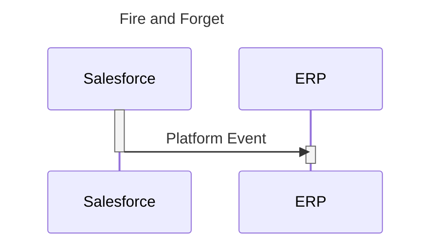
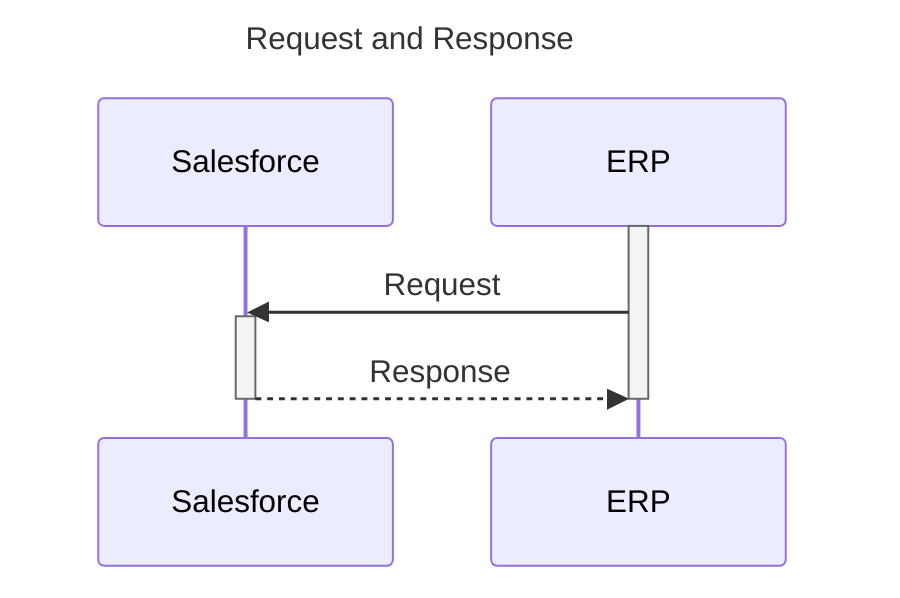
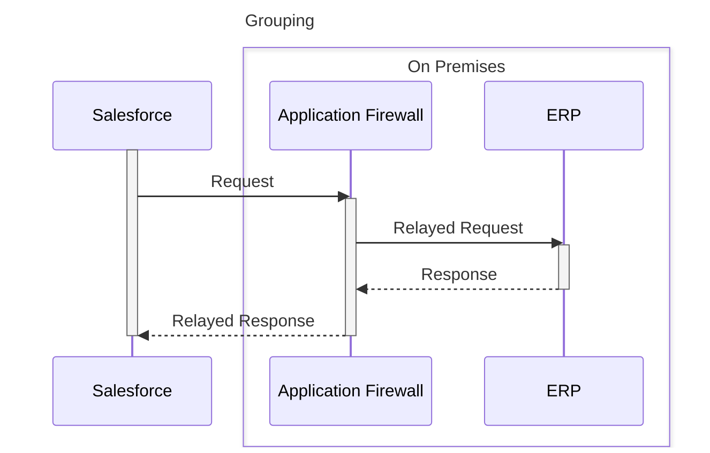
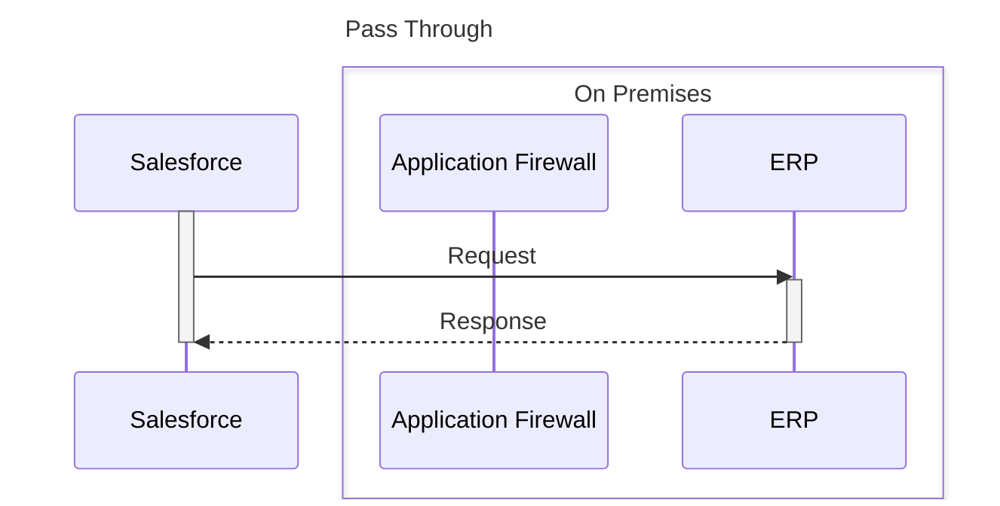
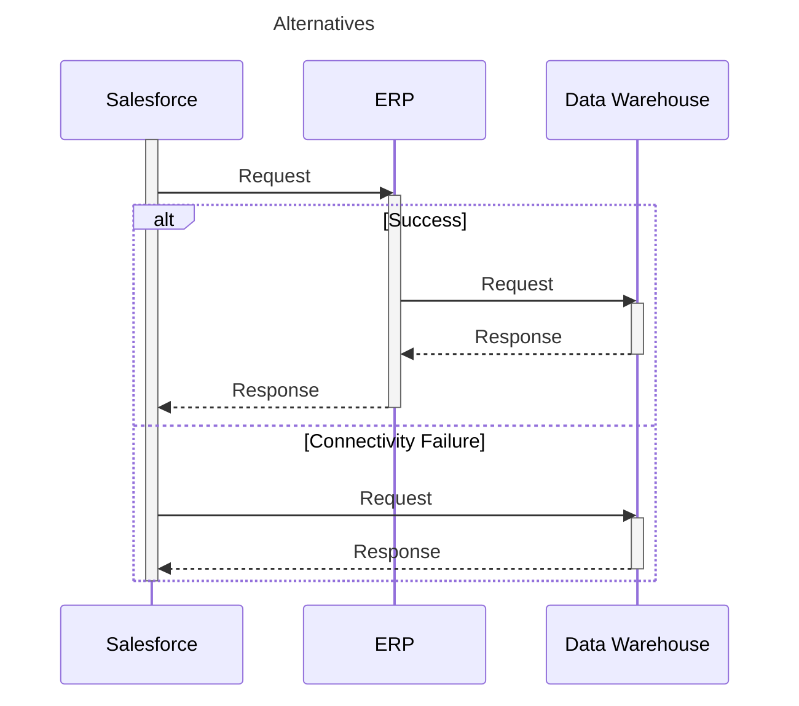

## Fire and Forget

```mermaid
sequenceDiagram

title Fire and Forget

participant SF as Salesforce

activate SF
SF->>ERP: Platform Event
deactivate SF

activate ERP
deactivate ERP
```

## Request and Response

```mermaid
sequenceDiagram

title Request and Response

participant SF as Salesforce

activate ERP
ERP->>SF: Request
activate SF
SF-->>ERP: Response
deactivate SF
deactivate ERP
```

## Grouping

```mermaid
sequenceDiagram

title Grouping

participant SF as Salesforce

box On Premises
participant AF as Application Firewall
participant ERP
end

activate SF
SF->>AF: Request
activate AF
AF->>ERP: Relayed Request
activate ERP
ERP-->>AF: Response
deactivate ERP
AF-->>SF: Relayed Response
deactivate AF
deactivate SF
```

## Pass Through

```mermaid
sequenceDiagram

title Pass Through

participant SF as Salesforce

box On Premises
participant AF as Application Firewall
participant ERP
end

activate SF
SF->>ERP: Request
activate ERP
ERP-->>SF: Response
deactivate ERP
deactivate SF
```

## Alternatives

```mermaid
sequenceDiagram

title Alternatives

participant SF as Salesforce
participant ERP
participant DW as Data Warehouse

activate SF

SF->>ERP: Request
activate ERP

alt Success
ERP->>DW: Request
activate DW
DW-->>ERP: Response
deactivate DW
ERP-->>SF: Response
deactivate ERP

else Connectivity Failure
SF->>DW: Request
activate DW
DW-->>SF: Response
deactivate DW

end
deactivate SF
```
